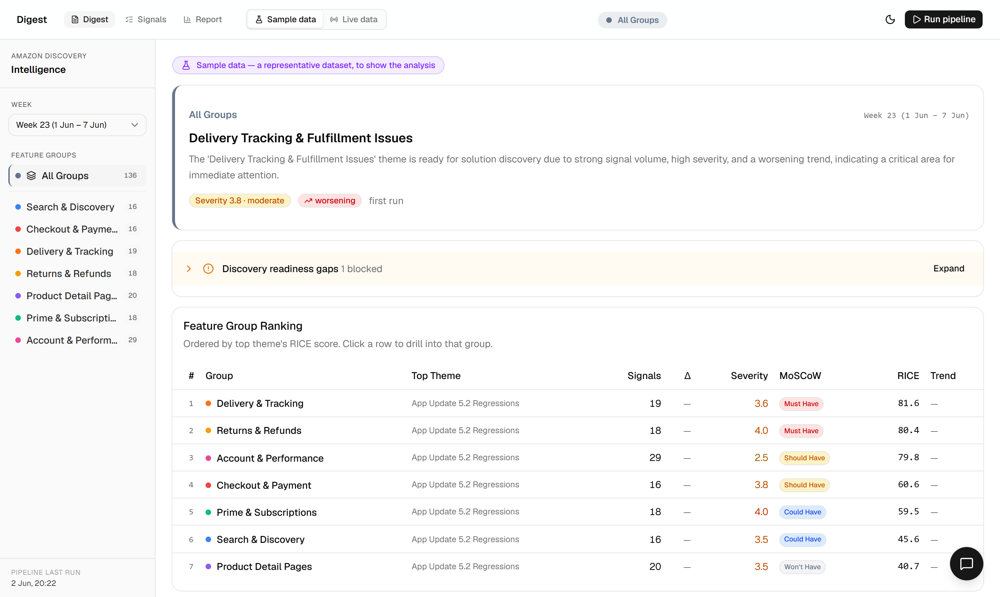
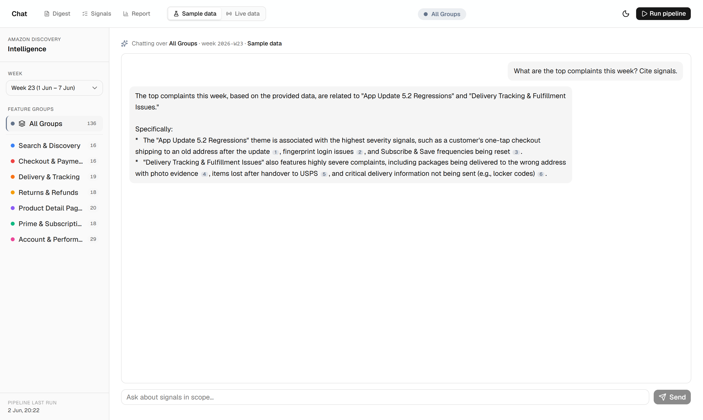

# Amazon Discovery Intelligence

Turn raw customer reviews of the Amazon Shopping app into a weekly,
RICE-prioritized **product-discovery digest** for PMs: themes ranked by RICE,
MoSCoW priorities, discovery-readiness, week-over-week trends, regression
alerts, and a grounded RAG chat over the signals.

**[Live demo](https://amazon-discovery-intel-repo.vercel.app/)** · [Backend API](https://amazon-discovery-34n34tq6za-el.a.run.app/health) ·


---

## What it does

A monthly pipeline ingests customer reviews, uses Gemini to clean and cluster
them into specific themes, scores everything, and publishes to a Google Sheet,
an email digest, a dashboard, and a chat.

- **Prioritization that's defensible** — RICE per theme `(reach x impact x
  confidence x version) / effort x trend`, percentile-based MoSCoW, and a
  discovery-readiness rubric (READY / NEEDS MORE EVIDENCE / BLOCKED).
- **Live ingestion** — Play Store (reliable), App Store, and Amazon product
  reviews (Jina), each with a substance filter and cross-run dedup. Falls back
  to a curated fixture.
- **Sample / Live toggle** — the defining design choice. A first-class switch
  scopes the *entire* product (digest, signals, chat, week-over-week, and even
  what a triggered run ingests), so the curated fixture and real data **never
  blend** — real week-over-week movement is never masked.
- **RAG chat with citations** — ask "what's hot in Returns this week?"; answers
  cite signals as footnotes you click to read the source review.
- **Closed loop** — styled email digest with thumbs-up/down feedback buttons,
  urgent regression alerts, and a Discovery Report where a PM edits effort and
  RICE recomputes live.

## The non-obvious bit

PMs don't lack customer signal, they drown in it. The hard part is knowing what
to prioritize and whether there's enough evidence to act. And: platform-quality
complaints live in app-store reviews and forums, **not** in product-listing
reviews (those are about the product, not Amazon) — so the source you reach for
matters as much as the analysis. See [BLURB.md](BLURB.md) and
[DECISIONS.md](DECISIONS.md).

## Chat, grounded in cited signals



## Architecture

```
Frontend (React + Vite, Vercel)                Backend (Express, Cloud Run)
  /digest /signals /report /chat   ── HTTPS ──►  POST /run-pipeline (monthly cron + on-demand)
  Sample/Live toggle, RAG chat                   GET  /digests /signals /runs/latest
                                                 POST /webhook/chat (SSE)
                                                      │
                  ┌───────────────────────────────────┼─────────────────────┐
                  ▼                  ▼                 ▼            ▼
            Vertex AI         Google Sheets        Gmail SMTP    (live sources:
        (clean, synthesize,   (system of record)   (digest +     Play / App / Amazon)
         readiness, chat)                           regression)
```

Pipeline stages: ingest -> normalize -> Gemini clean -> regression detect ->
Gemini synthesize -> aggregate -> RICE -> MoSCoW -> week-over-week -> readiness
-> write to Sheets -> email. Full detail in [CLAUDE.md](CLAUDE.md);
narrative in [CONTEXT.md](CONTEXT.md); deep-dives in
[docs/RAG_CHAT.md](docs/RAG_CHAT.md) and [docs/LIVE_INGESTION.md](docs/LIVE_INGESTION.md).

## Tech stack

| Area | Choice |
|---|---|
| Backend | TypeScript, Express, deployed to Cloud Run (monthly Cloud Scheduler) |
| AI | Vertex AI (Gemini 2.5 Flash) via ADC — no API keys |
| Store | Google Sheets (system of record) |
| Frontend | React 19, Vite, shadcn/ui on Tailwind v4, TanStack Query, Recharts |
| Email | Nodemailer (Gmail SMTP) |

## Run locally

```bash
# Backend (needs a service-account JSON + .env; see CLAUDE.md §10)
npm install && npm run dev          # http://localhost:3000

# Frontend
cd frontend && npm install && npm run dev   # http://localhost:5173
```
The frontend defaults to the production backend; set `VITE_API_BASE_URL=http://localhost:3000`
in `frontend/.env` to point at a local backend.

Deploy: backend `bash scripts/gcp-deploy.sh` (Cloud Shell); frontend on
Vercel/Netlify (root dir `frontend`, build `npm run build`, output `dist` —
config is in the repo). Details in [docs/CHECKLIST.md](docs/CHECKLIST.md).

## Status

Working end to end and deployed. Live ingestion is Play-Store-strong; App Store
is blocked from datacenter IPs and Amazon listing reviews are thin (both
documented honestly in [docs/LIVE_INGESTION.md](docs/LIVE_INGESTION.md)).
Roadmap: a Reddit source, a paid reviews API for iOS + critical reviews, and
auth. Project docs (`CLAUDE.md` / `CONTEXT.md` / `DECISIONS.md`) are kept in
sync with the code.
